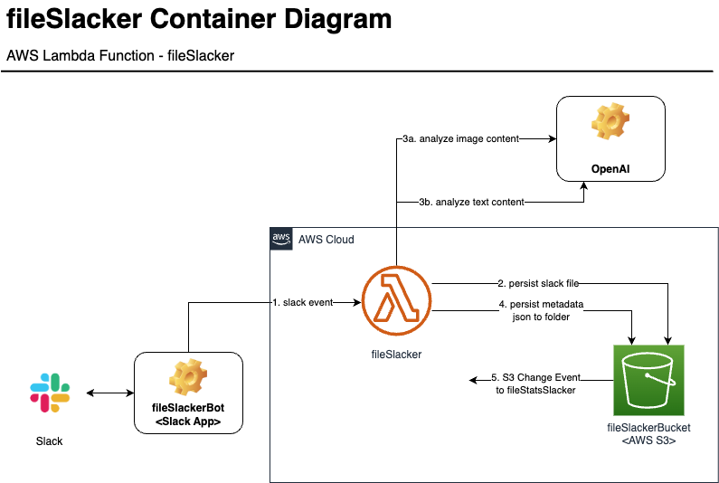

# fileSlackerBot


## Usage
The `fileSlackerBot` is triggered by mention of the app, `@fileSlackerBot` in a Slack message. The `fileSlackerBot` 
must be a member of the current channel, otherwise it can be added upon it's first mention in the channel.

When a file is attached to a message referencing `@fileSlackerBot`, it will be ultimately uploaded to S3. A reply will
sent back to the Slack user within the same Slack thread. This reply will contain an analysis of the file content as
well as summarize details of all the files in S3. *Currently, `fileSlackerBot` is limited to processing only one attached
file.* (Future feature or perhaps the application is simply living up to the _Slacker_ part of its name :laughing:)

The Slack user can also add text in the message referencing `@fileSlackerBot`. This text currently will not influence the
analysis of the file content (another future feature!).

## Technology Overview
The slack user interacts with the `fileSlackerBot` through @ mentions in Slack. The `fileSlackerBot` is a Slack
bot application defined in the [Slack APi](https://api.slack.com/apps/). Again it's configured to be triggered
by app_mentions events. Upon receiving one of these events, it makes an HTTP POST to the AWS API Gateway. The API 
Gateway acts as a trigger calling the AWS Lambda `FileSlacker` function.

The `FileSlacker` Lambda function creates a json object containing metadata from the received slack event. It then
persists the attached Slack file via a private Slack URL to the `file-slacker-bucket` S3 bucket. The files in the
`file-slacker-bucket` S3 bucket are keyed by the received Slack  A call is made to
the OpenAI API to do content analysis of the file. Lastly, the metadata is persisted to the `file-slacker-bucket/meta`
S3 bucket/folder. 

There is a trigger defined on the S3 bucket 


## Lambda Apps

### fileSlacker



### fileStatsSlacker


## S3
The [AWS S3 bucket](https://us-east-2.console.aws.amazon.com/s3/buckets/file-slacker-bucket?bucketType=general&region=us-east-2&tab=objects#) 
is named `file-slacker-bucket`. This bucket stores the raw files with the key being the `slack event id` concatenated 
with the file extension.

The `file-slacker-bucket` bucket also contains a [folder](https://us-east-2.console.aws.amazon.com/s3/buckets/file-slacker-bucket?region=us-east-2&bucketType=general&prefix=meta/&showversions=false) 
named `/meta`. This is used to store the JSON containing all the relevant metadata about the files. These records are 
keyed off the `slack event id` concatenated with the `json` extension.

## Athena
AWS Athena can be used to query the metadata records via SQL.

## Packaging for Deployment  
Use [Lambda Layers](https://docs.aws.amazon.com/lambda/latest/dg/chapter-layers.html?icmpid=docs_lambda_help) 
to deploy the python dependencies. The following can be used to create the zip archive to upload ...  
```
$ mkdir lambda_layers
$ cd lambda_layers
$ mkdir python
$ pip install -r ../requirements.txt --platform manylinux2014_x86_64 --target ./python --only-binary=:all:
$ zip -r python_modules.zip .
```  
Upload this dependency zip to the Lambda layers. The use of layers will keep your deployment small so that inline
editing in Lambda is still available. Pay attention to the versioning in layers ... it's rather straight-forward.

TODO: Set up a CI/CD pipeline using AWS Pipelines.

## Notes

Using "Ohio" for the region.
