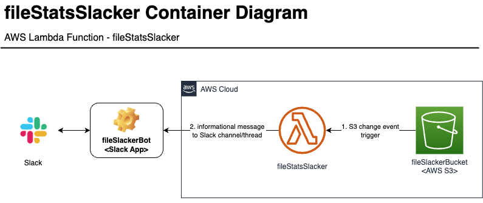

# fileSlackerBot


## Overview
A project allowing for the Slack upload of files to AWS S3 via events to AWS Lambdas.


## Slack API App

TODO: Container Diagram

Using  add the `fileSlackerBot` application and configure ...  

1. Create a new slack app `fileSlackerBot` at [Slack APi - Apps](https://api.slack.com/apps/)
    - from scratch
2. "OAuth & Permissions"
    - Bot Token Scopes
        - app_mentions:read
        - chat:write
        - remote_files:read **?**
    - Install to Workspace
3. Enable "Event Subscriptions"
    - "Subscribe to Bot Events"
        - Add "app_mention" Bot User Event

TODO: review the above

## Lambda Apps

### fileSlacker


### fileStatsSlacker



## S3
The [AWS S3 bucket](https://us-east-2.console.aws.amazon.com/s3/buckets/file-slacker-bucket?bucketType=general&region=us-east-2&tab=objects#) 
is named `file-slacker-bucket`. This bucket stores the raw files with the key being the `slack event id` concatenated 
with the file extension.

The `file-slacker-bucket` bucket also contains a [folder](https://us-east-2.console.aws.amazon.com/s3/buckets/file-slacker-bucket?region=us-east-2&bucketType=general&prefix=meta/&showversions=false) 
named `/meta`. This is used to store the JSON containing all the relevant metadata about the files. These records are 
keyed off the `slack event id` concatenated with the `json` extension.

## Athena
AWS Athena can be used to query the metadata records via SQL.

## Packaging for Deployment  
Use [Lambda Layers](https://docs.aws.amazon.com/lambda/latest/dg/chapter-layers.html?icmpid=docs_lambda_help) 
to deploy the python dependencies. The following can be used to create the zip archive to upload ...  
```
$ mkdir lambda_layers
$ cd lambda_layers
$ mkdir python
$ pip install -r ../requirements.txt --platform manylinux2014_x86_64 --target ./python --only-binary=:all:
$ zip -r python_modules.zip .
```  
Upload this dependency zip to the Lambda layers. The use of layers will keep your deployment small so that inline
editing in Lambda is still available. Pay attention to the versioning in layers ... it's rather straight-forward.

TODO: Set up a CI/CD pipeline using AWS Pipelines.

## Notes

Using "Ohio" for the region.
